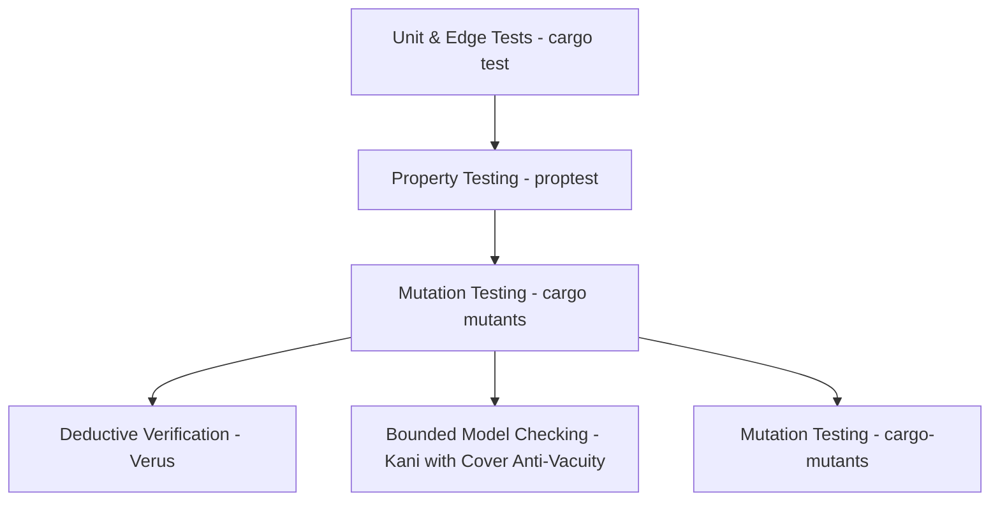

# 📄 Product Requirements Document (PRD)

# `skyauth`
### Pure Safe Rust AT Protocol OAuth 2.1, DPoP (RFC 9449), & PAR (RFC 9126) Client Library

---

## 1. Executive Summary & Problem Statement

### 1.1 Context
The **AT Protocol (ATProto)** — the decentralized networking foundation behind Bluesky — mandates modern OAuth 2.1 authentication for third-party clients, custom feed generators, labeling services, AppViews, and autonomous bots. Unlike legacy social protocols that rely on static API keys or user passwords, ATProto requires:
1. **RFC 9449 DPoP (Demonstrating Proof-of-Possession)**: Cryptographically binding access and refresh tokens to client-held asymmetric keys (ECDSA P-256) to eliminate token-theft and replay attacks.
2. **RFC 9126 PAR (Pushed Authorization Requests)**: Direct back-channel pushing of authorization parameters to the user's Personal Data Server (PDS) / Authorization Server with signed DPoP headers.
3. **RFC 7636 PKCE (Proof Key for Code Exchange)**: S256 verifier/challenge generation to eliminate authorization code interception.
4. **Decentralized Identity Discovery**: Resolving handles (`alice.bsky.social`), `did:plc`, and `did:web` identifiers to their authoritative PDS and OAuth authorization server endpoints via RFC 9728 and RFC 8414.

### 1.2 The Ecosystem Problem
Currently, virtually all production-grade ATProto OAuth tooling is maintained in TypeScript (`@atproto/oauth-client-node`, `@atproto/oauth-client-browser`). The Rust ecosystem for ATProto (such as `atrium`) focuses primarily on XRPC Lexicon schema compilation and legacy App Password authentication. 

Rust developers building high-performance ATProto services (feed generators, firehose indexers, labeling engines, CLI tools, and web dashboards) lack a standalone, modular, and memory-safe OAuth 2.1 client library that handles the intricate DPoP, PAR, and decentralized identity discovery flows out of the box. Furthermore, upstream protocol schema changes often cause silent breaking bugs unless continuously validated against official schemas.

### 1.3 The Solution
`skyauth` is a high-performance, `#![forbid(unsafe_code)]` pure Rust library that provides a comprehensive, turn-key implementation of AT Protocol OAuth 2.1 with full DPoP and PAR support. It incorporates **mathematical formal verification (Verus & Kani)** for security invariants and **dynamic schema validation with automated upstream drift detection** to guarantee 100% protocol alignment over time.

---

## 2. Core Vision & Design Principles

1. **Uncompromising Safety (`#![forbid(unsafe_code)]`)**:
   - Zero unsafe blocks in the entire crate root and all modules.
   - Built on proven, formally verified, pure-Rust cryptographic primitives (`p256`, `sha2`, `hmac`).
2. **Zero-Panic & Strongly Typed Errors**:
   - Deny `.unwrap()`, `.expect()`, `panic!`, `todo!`, and `unimplemented!` in production paths.
   - All fallible operations return strongly typed `Result<T, AtprotoOAuthError>`.
3. **Formal Mathematical Verification**:
   - Security-critical state machines, constant-time comparisons, and token lifecycles are formally proven using **Verus** (deductive verification) and **Kani** (bounded model checking with mandatory anti-vacuity gates).
4. **Dynamic Schema Invariants & Upstream Drift Protection**:
   - Bundles official ATProto Lexicons and RFC JSON schemas.
   - Tests dynamically parse schema ASTs to eliminate mirror-testing blindspots.
   - Continuous CI synchronization automatically fails builds on upstream schema drift.
5. **Spec-Compliant & Turnkey**:
   - Complete implementation of ATProto OAuth specifications, RFC 9449, RFC 9126, RFC 7636, RFC 8414, and RFC 9728.
   - Automatic `DPoP-Nonce` replay-retry negotiation (RFC 9449 § 4.3).
6. **Framework & Runtime Agnostic**:
   - Compatible with `tokio`, `axum`, `actix-web`, `tower`, and lightweight CLI tools.
   - Pluggable storage traits for session states (in-memory sharded, Redis, SQL, file-backed).
7. **High Concurrency & Low Latency**:
   - Sharded lock-free state stores with single-use atomic consumption for replay defense.
   - Sub-millisecond cryptographic proof generation and token verification.

---

## 3. Scope & Feature Requirements

### 3.1 Feature Matrix

| Module / Component | Spec Standard | Description |
| :--- | :--- | :--- |
| **DPoP Engine** | RFC 9449 | Ephemeral ECDSA P-256 key generation, RFC 7517 JWK formatting, signed `dpop+jwt` proof creation (`htm`, `htu`, `jti`, `iat`, `nonce`, `ath`), and automatic server nonce retry. |
| **PKCE Engine** | RFC 7636 | High-entropy 32-byte verifier generation, SHA-256 S256 challenge computation, and constant-time verification. |
| **Identity & Discovery** | RFC 8414 / RFC 9728 | Handle resolution (`com.atproto.identity.resolveHandle`), PLC directory lookups (`plc.directory`), `did:web` `.well-known/did.json`, OAuth protected resource discovery, and authorization server metadata discovery. |
| **Pushed Authorization (PAR)** | RFC 9126 | Direct HTTP POST authorization initiation to PDS with DPoP proof headers and `request_uri` extraction. |
| **Authorization Flow** | RFC 6749 / RFC 7591 | Client metadata document formatting (`/oauth/client-metadata.json`), login URL generation, and callback validation. |
| **Token Exchange & Refresh** | ATProto OAuth | Exchanging authorization codes for access/refresh tokens with DPoP proof, session renewal, and DID extraction. |
| **Session Management** | RFC 2104 / JWT | Pure safe Rust HMAC-SHA256 session token generation, constant-time verification (`constant_time_eq`), and expiration enforcement. |
| **State Storage** | Sharded Concurrency | 64-shard partitioned, TTL-bounded, atomic single-use state store for CSRF and replay defense. |
| **SSRF & Egress Protection** | Security Standard | Strict private IP filtering (RFC 1918, loopback, link-local, cloud metadata `169.254.169.254`) and no-redirect HTTP client enforcement. |
| **Dynamic Schema Engine** | ATProto / IETF | Runtime validation of egress payloads and ingress responses against official Lexicon & RFC JSON schemas. |
| **Upstream Drift Guard** | Continuous CI | Automated upstream schema synchronization and diff assertion preventing silent protocol breakage. |

---

## 4. Architectural Blueprint & API Design

### 4.1 Crate Architecture

```
skyauth/
├── src/
│   ├── lib.rs              # Crate root with #![forbid(unsafe_code)] and strict lints
│   ├── client.rs           # High-level AtprotoOAuthClient interface
│   ├── dpop.rs             # DPoPKey, JWK serialization, & RFC 9449 proof generator
│   ├── pkce.rs             # PKCE code_verifier and S256 challenge helpers
│   ├── resolver.rs         # DID, PDS, & RFC 8414/9728 metadata resolver
│   ├── store.rs            # Sharded in-memory and pluggable OAuthStateStore traits
│   ├── session.rs          # HMAC-SHA256 session signing & validation
│   ├── security.rs         # SSRF validation, restricted IP filtering, constant_time_eq
│   ├── types.rs            # Strongly-typed request, response, and metadata models
│   └── error.rs            # Strongly-typed AtprotoOAuthError enum
├── lexicons/               # Bundled official ATProto Lexicon schemas
│   └── com/atproto/
│       ├── identity/resolveHandle.json
│       └── server/createSession.json
├── schemas/                # Bundled official IETF RFC OAuth schemas
│   ├── rfc8414_authorization_server.json
│   ├── rfc9728_protected_resource.json
│   └── atproto_client_metadata.json
├── scripts/
│   └── sync_specs.sh       # Automated upstream spec synchronization & drift verification
├── tests/
│   ├── dpop_rfc9449_vectors.rs
│   ├── pkce_rfc7636_vectors.rs
│   ├── discovery_tests.rs
│   ├── token_exchange_tests.rs
│   ├── schema_compliance_tests.rs # Dynamic runtime schema AST validation
│   ├── kani_harnesses.rs          # Bounded model checking with anti-vacuity checks
│   ├── verus_proofs.rs            # Deductive verification contracts
│   └── adversarial_hardening_tests.rs
├── Cargo.toml
├── LICENSE-MIT
├── LICENSE-APACHE
└── README.md
```

### 4.2 Core API Signatures (Mockup)

```rust
use skyauth::{AtprotoOAuthClient, OAuthClientMetadata, OAuthStateStore};

#[tokio::main]
async fn main() -> Result<(), Box<dyn std::error::Error>> {
    // 1. Configure client metadata
    let metadata = OAuthClientMetadata::builder()
        .client_id("https://feed.example.com/oauth/client-metadata.json")
        .client_name("My Feed Generator")
        .redirect_uri("https://feed.example.com/oauth/callback")
        .build()?;

    // 2. Initialize OAuth client with thread-safe state store
    let client = AtprotoOAuthClient::new(metadata);

    // 3. Initiate login flow (resolves handle, generates PKCE, creates DPoP proof, calls PAR)
    let login_session = client.create_authorization_url("alice.bsky.social").await?;
    println!("Redirect user to: {}", login_session.authorization_url);

    // ... user completes consent on Bluesky and redirects to callback URI ...

    // 4. Exchange authorization code with PDS using DPoP proof
    let auth_result = client
        .exchange_code(&login_session.state, "auth_code_from_callback")
        .await?;

    println!("Authenticated DID: {}", auth_result.did);
    println!("DPoP-Bound Access Token: {}", auth_result.access_token);
    Ok(())
}
```

---

## 5. Security, Threat Model & Formal Proofs

1. **Token Theft & Replay (RFC 9449)**:
   - Tokens issued by the PDS are cryptographically bound to the client's ephemeral ECDSA key. Even if an access token is intercepted in transit, it cannot be used without generating a corresponding DPoP proof signed by the private key.
2. **Authorization Code Interception (RFC 7636)**:
   - S256 PKCE challenges ensure that only the entity possessing the original code verifier can complete the code exchange.
3. **State Poisoning & CSRF**:
   - OAuth state tokens are generated with 256 bits of cryptographic entropy, stored in a 64-shard partitioned memory store, and consumed atomically via `take` (single-use).
4. **Server-Side Request Forgery (SSRF)**:
   - All outbound network calls to PDS or authorization servers strictly pass through `validate_outbound_url` and `is_restricted_ip`, preventing loopback (`127.0.0.1`), private RFC 1918 egress, and cloud metadata (`169.254.169.254`) exfiltration.
5. **Timing Side-Channels**:
   - Signature checks and token verifications utilize constant-time slice comparison (`constant_time_eq`).

---

### 5.1 Formal Verification & Mathematical Invariants: Verus & Kani

To provide mathematical certainty of security invariants without falling into LLM verification traps, we employ a multi-layered formal verification hierarchy:



#### Layer 1 (Primary): Verus Deductive Verification (`verus!`)
We leverage [**Verus**](https://github.com/verus-lang/verus) (Microsoft Research / CMU / VMware) to enforce **contract-driven code generation**:
- **Why Verus**: Unlike model checking harnesses where an LLM can inadvertently write contradictory assumptions (`assume(false)`), Verus checks Hoare-logic contracts (`requires`, `ensures`, `invariant`, `decreases`) **directly on the function body**. This eliminates vacuous proofs and forces the LLM to write structurally superior, defensively branched, and mathematically sound code.
- **Contract 1: Single-Use State Consumption**:
  ```rust
  // Proves that taking an active session key strictly removes it from the domain and returns Some(session),
  // while any repeated attempt or absent key returns None and leaves store state invariant.
  pub fn take(&mut self, key: Seq<u8>) -> (res: Option<OAuthSessionState>)
      requires old(self).store.dom().finite(),
      ensures
          old(self).store.contains_key(key) ==> (
              res == Some(old(self).store[key]) &&
              !self.store.contains_key(key)
          ),
          !old(self).store.contains_key(key) ==> (
              res == None &&
              self.store =~= old(self).store
          );
  ```
- **Contract 2: PKCE S256 Mathematical Bijection**:
  Prove that `verify_pkce(verifier, challenge)` returns `true` if and only if `challenge == base64url_unpadded(sha256(verifier))` with zero false-positive verifications across arbitrary symbolic strings.
- **Contract 3: Timestamp & Monotonic Arithmetic Safety**:
  Prove that monotonic time calculations (`created_at + ttl_secs`) cannot overflow on 32-bit or 64-bit platforms and that expired sessions strictly evaluate to invalid.
- **Contract 4: SSRF Restricted IP Rejection Invariant**:
  Prove that `is_restricted_ip(ip)` returns `true` for all loopback (`127.0.0.0/8`, `::1`), private RFC 1918 (`10.0.0.0/8`, `172.16.0.0/12`, `192.168.0.0/16`), link-local (`169.254.0.0/16`), and carrier-grade NAT ranges.

#### Layer 2 (Complementary): Kani Bounded Model Checking with Anti-Vacuity Gates (`tests/kani_harnesses.rs`)
For bit-level transformations and low-level byte packing:
- All Kani harnesses (`#[kani::proof]`) **must enforce strict anti-vacuity**:
  1. Mandatory `kani::cover!()` reachability statements ensuring execution paths are actually exercised.
  2. Proof validation via `cargo-mutants` (enforced in CI at a 70% kill-rate floor, with
     formal-verification module sources excluded as they are the specification, not subject):
     synthetic bug injection must cause the suite to fail, or the gap is a test debt item.

---

### 5.2 Dynamic Schema Invariants & Upstream Drift Detection

To prevent subtle schema divergence, naming errors, or casing bugs (e.g. `camelCase` vs `snake_case` in Lexicons vs OAuth RFCs):

1. **Embedded Canonical Specifications**:
   - The crate bundles official JSON schemas in `lexicons/` and `schemas/`.
2. **Runtime AST-Level Invariant Tests (`tests/schema_compliance_tests.rs`)**:
   - Dynamically loads schema ASTs using `include_str!` and validates raw `serde_json::Value` payloads.
   - Asserts that all generated client metadata, PAR requests, DPoP JWT headers, and token requests strictly conform to required properties and field name casings.
   - Eliminates mirror-testing blindspots where serializers and deserializers share identical bugs.
3. **Automated Continuous Upstream Drift Detection (`scripts/sync_specs.sh`)**:
   - Runs in CI on every PR, fetching official Lexicons and RFC schemas from `bluesky-social/atproto` and IETF.
   - Fails CI immediately upon detecting schema drift, preventing unannounced upstream changes from breaking consumers.

---

## 6. Implementation Milestones

- [x] **Milestone 1: Cryptographic & Token Primitives**
  - Extract `DPoPKey`, `PKCE`, `HMAC-SHA256`, and constant-time comparison into isolated modules.
  - Implement full RFC test vectors for RFC 7636 and RFC 9449.
- [x] **Milestone 2: Identity & Metadata Resolver**
  - Implement handle resolution, `did:plc`, `did:web`, RFC 9728 protected resource discovery, and RFC 8414 metadata discovery.
  - Implement SSRF and restricted IP egress filters.
- [x] **Milestone 3: PAR & Token Exchange Pipeline**
  - Implement Pushed Authorization Requests (`/oauth/par`) with DPoP headers.
  - Implement `/oauth/token` exchange with automatic `DPoP-Nonce` replay-retry loop.
- [x] **Milestone 4: Storage & Web Framework Integrations**
  - Implement 64-shard `OAuthStateStore` with TTL pruning.
  - Provide Axum, Actix, and Tower middleware/handlers examples.
- [x] **Milestone 5: Dynamic Schema Compliance & Upstream Drift CI**
  - Bundle official Lexicon and RFC schemas in `lexicons/` and `schemas/`.
  - Implement `tests/schema_compliance_tests.rs` with runtime AST validation.
  - Add `scripts/sync_specs.sh` and CI schema drift verification.
- [x] **Milestone 6: Verus & Kani Formal Verification Suite**
  - Implement Verus specifications for `OAuthStateStore`, PKCE `S256` verification, and SSRF boundary filters.
  - Implement `tests/kani_harnesses.rs` with mandatory `kani::cover!()` anti-vacuity reachability checks.
  - Integrate formal verification checks into continuous integration pipeline.
- [ ] **Milestone 7: Documentation, Benchmarks & Crates.io Publication** *(docs complete; latency benchmarks & crates.io publication pending → see §7.1 trade-off notes and release checklist)*
  - 100% rustdoc documentation coverage (`missing_docs` denied).
  - Latency benchmarks asserting $< 1.0\text{ms}$ proof generation.
  - Publish `v0.1.0` to crates.io and GitHub.

---

## 7. Future Advancements & Accepted Trade-offs

This section records deliberate engineering trade-offs made during 0.2.0 development, with the conditions under which each should be revisited.

### 7.1 Per-Origin Pinned Client Pooling (Performance)

**Current state**: `SsrfFilter::build_pinned_client` constructs a fresh `reqwest::Client` for every outbound request (and again per DPoP nonce retry), discarding connection pooling and TLS session reuse. A login flow pays 2-3 full TCP + TLS handshakes where a pooled client would pay one.

**Why it is the right trade-off today**:
- Skyauth's outbound traffic is low-volume, security-critical control flow (identity resolution, discovery, PAR, token exchange), not per-request fanout.
- A shared client's connection pool outlives DNS re-validation: a pooled connection routed to a previously-approved IP silently bypasses the per-request `resolve()` pinning that defeats DNS rebinding. Simple, obviously-correct per-request pinning was preferred over pool-lifetime reasoning.
- Costs are dominated by the same-path DPoP signing and state-store checks (all sub-millisecond), so handshake overhead only matters in already-fast network conditions.

**Upgrade path (candidate for 0.3.0)**: implement a `PinnedClientCache` in `SsrfFilter`:
- Keyed by origin, storing the verified `SocketAddr` alongside the pooled client.
- TTL-based re-validation of resolved IPs on reuse, plus an explicit `invalidate(host)` hook.
- Formal invariant to re-prove: pinned-IP stability across pool reuse (Kani/Verus property test that a cached client's socket address is re-validated, never stale).

Opt-in via a builder knob; keep the current per-request behavior as the default until deployment profiling shows pooling matters more than audit simplicity.

### 7.2 Shared Replay-Cache Backend (Horizontal Scale)

**Current state**: `DPoPReplayCache` is per-process (`Arc`-sharded in-memory). Multi-replica deployments behind a load balancer have a wider replay exposure than the single-process guarantee implies — RFC 9449 § 11.1 bounds the exposure by the proof acceptance window, but strict multi-replica anti-replay needs a shared store (e.g. Redis) behind the `OAuthStore` trait's existing abstraction seam.

### 7.3 Confidential-Client `private_key_jwt`

Client metadata advertises `private_key_jwt` support (per the ATProto profile), and `ParParameters::with_client_assertion` carries the assertion fields, but the client never mints/attaches a signed client-assertion JWT automatically for confidential clients beyond `client_secret_post`. Auto-assertion generation (ES256-signed `client_assertion` bound to a registered JWKS) is a candidate for a 0.3.0 milestone.

---

## 8. Success Metrics & Performance SLAs

- **Safety & Verification**: 100% `#![forbid(unsafe_code)]`, zero production panics, 100% passing Verus deductive contracts, and 100% passing Kani reachability proofs (`kani::cover`).
- **Schema Conformity**: 100% pass rate on dynamic AST Lexicon & RFC schema validation tests with 0 schema drift in CI.
- **Latency**:
  - DPoP proof generation: $< 250\,\mu\text{s}$ (p99).
  - PKCE S256 computation: $< 50\,\mu\text{s}$ (p99).
  - Memory footprint: $< 5\,\text{MB}$ under 50,000 active concurrent OAuth sessions.
- **Test Coverage**: $> 90\%$ code coverage across unit, integration, proptest, and mutation test suites.
